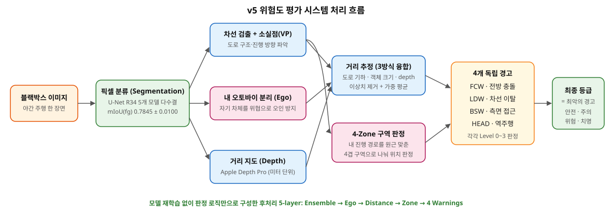

# 야간 오토바이 블랙박스 위험도 평가 시스템

> 야간 오토바이 주행 영상의 한 장면을 입력하면, 그 순간이 얼마나 위험한지 **4단계(안전/주의/위험/치명)** 로 자동 판정하는 시스템. 사고 영상을 해설하는 "한문철 TV"에, 대상의 위험도를 즉석에서 숫자로 보여주는 "스카우터"를 합친 컨셉이다.

**AIFFEL DLthon** · 2026.04.22 ~ 04.24 (3일) · 세그멘테이션 모델 학습 + 후처리 판정 파이프라인 설계·구현

[최종 HUD  4단계 등급별 대표 프레임 (안전/주의/위험/치명)]


## 결과

| 지표 | 값 | 의미 |
|---|---|---|
| 위험도 판정 (GT 보유 9장) | **Exact 9/9 (100%)** | 정답 등급이 있는 실주행 프레임 9장을 등급까지 전부 정확히 판정 |
| Segmentation mIoU(fg) | 0.7845 ± 0.0100 (Lane Focus 5-fold CV) | 픽셀 단위로 도로·차선·차량을 구분하는 모델의 정확도 |
| Lane Mark IoU | 0.3611 (5-fold ensemble, +2.2%p) | 최대 난제였던 차선 인식  전체 픽셀의 0.6%뿐인 클래스 |
| 시스템 버전 | v2.6 → **v6** (7회 전면 개편) | 3일간 판정 구조를 7번 갈아엎으며 도달 |

## 어떻게 동작하나 (v5 final)



1. **픽셀 분류 (Segmentation)**  화면의 모든 픽셀을 도로/차선/차량/내 오토바이 등 7종으로 분류. 서로 다르게 학습한 모델 5개의 다수결(5-fold ensemble)로 안정성을 높였다.
2. **내 오토바이 분리 (Ego)**  화면에 찍힌 내 차체를 위협 대상에서 제외. 자기 자신에게 충돌 경고를 울리는 오작동을 막는다.
3. **도로 구조 파악**  차선과 소실점(VP, 도로가 모이는 지평선 위의 점)으로 진행 방향과 원근을 계산한다.
4. **거리 추정**  도로 기하·객체 크기·depth 모델, 서로 독립적인 3가지 방법으로 거리를 각각 추정한 뒤 이상치를 버리고 융합한다.
5. **구역 판정 (4-Zone Corridor)**  거리 숫자를 그대로 쓰지 않고, 내 진행 경로를 원근에 맞춘 4겹 구역으로 나눠 "어느 구역에 들어왔는가"로 변환한다.
6. **4개 독립 경고 → 최종 등급**  전방 충돌(FCW)·차선 이탈(LDW)·측면 접근(BSW)·역주행(HEAD)을 각각 따로 판정하고, **가장 심각한 경고 하나가 그대로 최종 등급이 된다.** 점수 합산은 하지 않는다.

## 핵심 설계 결정  가설 주도 개발

시스템의 각 축은 "가설 세우기 → 데이터로 검증 → 설계에 반영"의 순서로 만들어졌다. 프로젝트에서 세운 가설 6개:

| # | 가설 | 검증 | 설계 반영 |
|---|---|---|---|
| H1 | "정상 운전자는 차선을 지킨다" | 도메인 10장 모두 직진  차선 유지 ↔ 정상 주행 1:1 대응 | 차선 침범 감지 (LDW) |
| H2 | "거의 모든 프레임은 직진 상황" | GT 라벨 수집 후 10장 전부에서 확인 | 진행방향 위협 flag 제거 (노이즈원) |
| H3 | "바이크 블랙박스에서 내 차체는 화면 중앙 하단" | 카메라 장착 위치의 물리적 사실 | Ego mask 중앙 하단 anchor |
| **H4** ⭐ | "점수 합산 자체가 잘못된 추상화다" | 터닝포인트  아래 상술 | 4 독립 경고, bin = max |
| H5 | "거리 metric 값보다 zone + confidence" | Mobileye/OpenPilot 등 업계 관행 리서치 수렴 | 4-zone corridor |
| H6 | "모르는 건 모른다고 말한다" | Test 30장 오탐 확인, 실환경 차선 감지 난이도 | 측정 불가 guard |

이 중 시스템의 성격을 결정한 3개:

**H4  "점수 합산 자체가 잘못된 추상화다"** (터닝포인트)
위험 요소마다 벌점을 매겨 합산하는 방식(v2.6~v4)은 파라미터 튜닝 지옥으로 이어졌다 (Exact 5/10 → 2/10 하락). 신호를 하나의 점수로 합치는 대신 **4개 독립 경고의 max**를 취하자 즉시 6/10으로 반등했고, 이후 모든 개선이 이 위에서 이루어졌다. 복잡도 추가가 아니라 추상화 교체가 돌파구였다.

**H5  "거리 metric 값보다 zone + confidence"**
거리값을 판정에 직접 쓰면 추정 오차가 그대로 판정 오차가 된다. Mobileye/OpenPilot 등 업계 관행 리서치도 같은 방향으로 수렴: bbox 발끝 기준, 차선폭 정규화, 해상도 독립적인 구역 판정. 원근 사다리꼴 4-zone corridor로 구현했다.

**H6  "모르는 건 모른다고 말한다"**
측정이 불가능한 상황(대상이 측면으로 70% 이상 치우친 경우)을 억지로 판정하지 않고 guard 처리했다.
최종 Exact 9/9는 이 guard까지 적용한 v5에서 달성.
이 원칙을 전면 확장한 실험이 v6("신뢰 구간만 말하기")이며, 답한 케이스의 정확도 대신 커버리지를 희생한다(Exact 5/9).

## 기록된 실패

- **Apple Depth Pro 전면 교체 시도**: 미터 단위 절대 거리를 주는 모델이라 기대가 컸고 기술적으로도 성공했다 (metric depth + focal 자동 추정 동작 확인). 그러나 정답 라벨이 거리 기준이 아니라 상황 기준이라 판정 정확도가 9→6으로 하락 → **롤백**. 더 정확한 측정이 더 좋은 판정을 보장하지 않는다.
  → 이후 metric 거리값을 판정에 직접 쓰지 않고 4-zone 구역 판정으로 변환해 소비하는 구조로 바꾸면서 Depth Pro를 재도입, 최종 채택 ([모델정보](./모델정보.ipynb) 참고).
- **v3.x hierarchical + 파라미터 튜닝**: 구조를 바꾸지 않는 튜닝은 정확도를 2/10까지 악화시켰다. local optimum의 전형.

## 직접 돌려보기

1. **환경** — `pip install -r requirements.txt` (Python 3.13 에서 검증, GPU 권장)
2. **체크포인트** — 학습된 U-Net R34 5-fold 를 Hugging Face Hub 에서 받는다:
   ```python
   from huggingface_hub import hf_hub_download
   ckpts = [hf_hub_download('minoak/motorcycle-night-lane-focus', f'lane_focus_fold{i}_best.pth')
            for i in range(5)]
   ```
3. **추론** — [src/RISK_ASSESSOR_V5.ipynb](./src/RISK_ASSESSOR_V5.ipynb) 를 열어 [samples/](./samples) 의 이미지 3장(안전/주의/위험 각 1장)으로 실행하고, 결과를 `samples/expected_outputs.json` 과 대조한다.
4. **학습 재현** — [train/](./train) 참고. Kaggle 데이터 다운로드 → 전처리 → 5-fold 학습 (fold당 13~16분).

## 파일 안내

| 파일 | 내용 |
|---|---|
| [위험도 평가 시스템 아키텍처.ipynb](./위험도%20평가%20시스템%20아키텍처.ipynb) | **여기부터**  가설 6개, 버전 진화, 핵심 실험 기록 |
| [모델정보.ipynb](./모델정보.ipynb) | 최종 시스템 설명서 (데이터, 모델, 하이퍼파라미터, 파이프라인 전체) |
| [버전6.ipynb](./버전6.ipynb) | v6 "신뢰 구간만 말하기"  H6 확장, V5 대비 실측 비교 |
| [데이터탐색.ipynb](./데이터탐색.ipynb) | EDA  클래스 분포 (Lane Mark 0.6% 병목), 도메인 특성 |
| [src/RISK_ASSESSOR_V5.ipynb](./src/RISK_ASSESSOR_V5.ipynb) | **실행 코드**  v5 최종 self-contained 배포 노트북 (외부 .py import 불필요) |
| [src/](./src) | v5 모듈 소스  ego_corridor (4-zone) · geometric_distance (3-estimator fusion) · hud_v5_clean (HUD 렌더) · simple_tracker (IoU tracker) |
| [train/](./train) | **세그멘테이션 학습 코드**  Lane Focus 5-fold 재현 (전처리 → 학습, 실제 학습 기록 포함) |
| [samples/](./samples) | 샘플 3장 (안전/주의/위험) + GT 마스크 + 기대 출력 JSON |
| [requirements.txt](./requirements.txt) | 실행 환경 (버전 고정) |

> ⚠️ 노트북 용량이 커서 GitHub 렌더링이 느릴 수 있습니다. [nbviewer](https://nbviewer.org/)에 URL을 붙여 넣으면 안정적으로 열립니다.

**데이터**: Kaggle  Motorcycle Night Ride Segmentation (200장, 7-class semantic segmentation)
